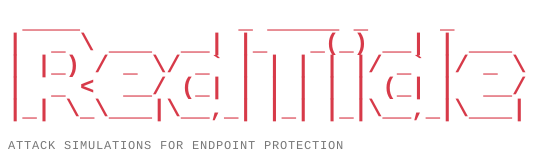

<h1></h1>

**RedTide is an open-source attack simulation tool for testing Microsoft Defender for Endpoint on Windows.** Use it in a lab to trigger specific security controls and examine how Defender responds.

A simulation might create an antivirus test file, run a script containing a recognized test pattern, or try to launch a child process from Word to exercise an attack surface reduction rule. These are controlled tests using test artifacts and scripted behavior rather than live malware. RedTide packages [Microsoft's published endpoint security test procedures](https://learn.microsoft.com/en-us/defender-endpoint/defender-endpoint-demonstrations) into a guided menu.

Instead of preparing each test by hand, you select a scenario and RedTide handles its setup and scripted steps, explains the expected result, and provides a cleanup option. Some tests still need a manual action, such as opening Word or a browser. You review the detections in Defender yourself; a completed script is not proof that a protection worked.

The tool is written in PowerShell and can target either the local Windows machine or an existing Azure Windows VM through Run Command.

**[See RedTide in action: screenshot walkthrough](docs/walkthrough.md)**

Follow a local run from the welcome screen through an AMSI test, the resulting Defender alert, and cleanup.

An independent community project. Not an official Microsoft product, and not supported or endorsed by Microsoft.

> **Disposable labs only.** Use only systems you own or have explicit permission to test. RedTide changes Defender preferences, policy registry values, exclusions, and files. Some scenarios download and execute test programs. Do not run it on a work computer, production device, or a host containing valuable data. Take a VM checkpoint or equivalent recoverable backup first. Cleanup is **not** a complete rollback.

## How it works

Start with **`Start-RedTide.ps1`**. It is the entry point for both local and Azure runs: it reads your parameters, displays the menus, checks the target, captures selected Defender settings, and calls the scenario you choose. The individual tests live in **`redtide-modules`**, so their commands are separate from the menu and shared execution code.

```text
RedTide\
|-- Start-RedTide.ps1                 Entry point and shared helpers
|-- Start-RedTide.Tests.ps1           Pester tests
|-- docs\
|   |-- walkthrough.md               Screenshot walkthrough
|   `-- screenshots\                Walkthrough images
|-- redtide-modules\
|   |-- Deploy-AmsiStrike.ps1         AMSI scenario
|   |-- Deploy-AsrRulesStrike.ps1     ASR rules scenario
|   |-- Deploy-EdrDetectionStrike.ps1 EDR scenario
|   |-- ...                          Other scenario scripts
|   `-- Remove-AllStrikes.ps1         Cleanup
|-- README.md
`-- LICENSE
```

The files in `redtide-modules` are ordinary `.ps1` scripts, not separately installed PowerShell modules. The entry point loads the selected file into its session and calls the function defined there. Those functions use shared helpers such as `Write-Log` and `Invoke-DemoCommand`, so **run the entry point rather than launching a scenario file directly**. Keep the folder beside `Start-RedTide.ps1`; downloading only that one file is not enough.

For example, selecting `Amsi` follows this path:

```text
Start-RedTide.ps1
  -> Invoke-Scenario selects Deploy-AmsiStrike.ps1
  -> Deploy-AmsiStrike prepares the test commands
  -> Invoke-DemoCommand runs each step on the selected target
  -> The console shows output and instructions for reviewing the detection
```

`Invoke-DemoCommand` handles the difference between targets. In **local mode**, it runs the commands in a PowerShell background job on the same computer. In **Azure mode**, it sends them to the VM through `Invoke-AzVMRunCommand`. The scenario scripts use this shared runner rather than each implementing their own Azure connection, progress display, timeout handling, and command logging. Browser and Word steps still require you to interact with the target desktop.

After a scenario, inspect the results in Defender as directed by the console. When finished, select **Cleanup**, which loads `Remove-AllStrikes.ps1` through the same entry point. Cleanup is a separate action, not something that runs automatically after each test; its recovery limits are described [below](#cleanup-and-recovery).

## Prerequisites

### Both modes

- A supported **64-bit Windows** lab target with Microsoft Defender Antivirus active and real-time protection enabled. Use 64-bit Windows PowerShell 5.1 as the baseline runtime. The entry point requires PowerShell 5.1 or later; this release has not been end-to-end qualified across PowerShell versions or Windows editions.
- An interactive terminal. Even with `-Scenario`, the current implementation still prompts for checks, confirmation, and results. It is **not an unattended automation interface**.
- Internet access from the target for the selected Microsoft or AMTSO demonstrations and Defender services. Read the [official demonstration requirements](https://learn.microsoft.com/en-us/defender-endpoint/defender-endpoint-demonstrations) first.
- The ASR scenario downloads [Microsoft's official test document](https://demo.wd.microsoft.com/Content/TestFile_OfficeChildProcess_D4F940AB-401B-4EFC-AADC-AD5F3C50688A.docm) and verifies its integrity before use. The computer running `Start-RedTide.ps1` needs internet access for that download.
- For EDR and portal telemetry: a device onboarded to Defender for Endpoint with a running Sense sensor, appropriate licensing (EDR requires Plan 2 or an equivalent entitlement), and permission to view the device in the [Defender portal](https://security.microsoft.com).
- A desktop session for interactive tests: Microsoft Edge for SmartScreen, Chrome or Firefox for the Network Protection browser demonstration, and Word for the ASR Office demonstration.
- Reserve `C:\MDE-Demo` and `C:\demo` exclusively for the lab. Scenarios write to these fixed paths and cleanup recursively removes both directories.

Local AV demonstrations can run without MDE onboarding, but they will not provide EDR alerts or the same portal experience.

### Local mode

Open **64-bit Windows PowerShell as Administrator** on the disposable target. No Az modules or Azure sign-in are needed. All scenario changes affect that computer directly.

### Azure mode

- An existing running Windows VM with a healthy Azure VM agent and Run Command connectivity. RedTide does not provision a lab or onboard the VM.
- On the controller: Az PowerShell modules, including `Az.Accounts`, `Az.Compute`, and `Az.Resources`. The latter supplies resource-group and role-assignment commands used by the preflight wizard. Installing the `Az` bundle covers these dependencies.
- An authenticated Az context for the intended subscription. Use `Connect-AzAccount` and verify your context before starting. `-SubscriptionId` selects a subscription during the applicable preflight path; do not rely on it to replace checking your context when skipping checks.
- Appropriate VM read/Run Command permissions; the wizard expects roles such as Virtual Machine Contributor or Contributor at the relevant resource scope. Some optional remediation steps need additional privileges. Follow least privilege and review every offered change.
- A desktop connection such as RDP or Bastion for manual demonstrations. Run Command executes noninteractively as SYSTEM; it cannot display Word or a browser to the signed-in user.

If modules are missing, the wizard can offer a current-user `Az` installation. It can also offer sign-in, VM startup, and other environment remediation. Preflight is not strictly read-only; review prompts rather than accepting them on a production environment. Azure resource charges are your responsibility.

## Usage

Clone or download this repository and keep `Start-RedTide.ps1` beside `redtide-modules`. Run commands from its root in the appropriate lab shell:

```powershell
# Choose local or Azure mode, then preflight and a scenario
.\Start-RedTide.ps1

# Local: run the interactive menu on this disposable host
.\Start-RedTide.ps1 -Local

# Local: select one demonstration (still interactive)
.\Start-RedTide.ps1 -Local -Scenario AntivirusValidation

# Azure: target an existing, onboarded lab VM
.\Start-RedTide.ps1 -Scenario CloudProtection `
    -ResourceGroup 'redtide-lab-rg' -VMName 'redtide-win11'

# Optional explicit subscription; replace the placeholder with your own
.\Start-RedTide.ps1 -Scenario EdrDetection `
    -ResourceGroup 'redtide-lab-rg' -VMName 'redtide-win11' `
    -SubscriptionId '<your-subscription-id>'

# Preview scenario dispatch on a disposable lab host; see limitations below
.\Start-RedTide.ps1 -Local -Scenario AntivirusValidation -WhatIf
```

`-Local` cannot be combined with `-ResourceGroup`, `-VMName`, or `-SubscriptionId`. Other options:

| Parameter | Behavior |
| --- | --- |
| `-Scenario` | A scenario name below, `All`, or `Cleanup`; omitted for the menu. `All` attempts the 13 scenarios sequentially and continues after failures. |
| `-LogPath` | Override the controller log path; ensure its parent directory exists. |
| `-SkipChecks` | Skips the full preflight page on the first pass, but **does not skip connection checks or make execution unattended**. |
| `-WhatIf` | Uses `ShouldProcess` in the scenario command dispatcher. **Not a side-effect-free dry run**: startup, logs, connection/preflight operations, baseline capture, and the ASR sample download are outside that dispatcher. Do not use it as a safety boundary. |

Navigate with arrow keys and Enter. Help (`?`) and About (`A`) are available on the welcome menus. Briefings describe expected behavior and follow-up verification.

## Scenarios

| Name | What it does / remaining manual work |
| --- | --- |
| `CloudProtection` | Checks/enables cloud protection and downloads the published test ZIP; extraction and execution are manual. |
| `Amsi` | Writes AMSI test scripts and runs the PowerShell test; additional script-host tests are manual. |
| `AntivirusValidation` | Writes the EICAR antivirus test string and checks for detection. |
| `BehaviorMonitoring` | Runs the published suspicious PowerShell behavior test. |
| `Pua` | Enables PUA protection and attempts the AMTSO test download; a browser test may still be required. |
| `AppReputation` | Checks prerequisites and provides manual Edge SmartScreen download tests. |
| `UrlReputation` | Checks prerequisites and provides manual Edge SmartScreen test URLs. |
| `ControlledFolder` | Creates dummy documents in `C:\demo`, adjusts CFA/ASR/exclusions, and executes the ransomware-behavior test program. The documents can be changed if protection does not block it. |
| `AsrRules` | Retrieves and verifies Microsoft's Office child-process test document, enables nine ASR rules, and deploys the document and a manual Office launcher. Requires Word and an interactive desktop on the target. |
| `CfaTestTool` | Enables CFA and downloads the Microsoft CFA GUI test tool; launch it manually in a lab desktop session. |
| `ExploitProtection` | Downloads and applies a mitigation XML policy after attempting a backup. Inspect Windows Security for results; an alert is not the goal. |
| `NetworkProtection` | Enables Network Protection and attempts a URL request. Use a non-Edge browser for the visual demonstration. |
| `EdrDetection` | Checks onboarding and runs a suspicious process-chain test for EDR telemetry. |

Success messages generally indicate script dispatch or setup completion, **not proof that protection blocked the test**. Some modules report success after warnings or download failures. Inspect logs, local Defender events, and the device timeline/Advanced Hunting as appropriate. Not every prevention event becomes an alert; alert timing and results depend on policy, licensing, sensor health, and cloud connectivity.

## Cleanup and recovery

Use the same target and retain its original baseline until you are finished:

```powershell
# Local cleanup has an additional confirmation
.\Start-RedTide.ps1 -Local -Scenario Cleanup

# Azure cleanup
.\Start-RedTide.ps1 -Scenario Cleanup `
    -ResourceGroup 'redtide-lab-rg' -VMName 'redtide-win11'
```

Before a non-cleanup scenario, RedTide attempts to save selected Defender settings to `C:\MDE-Demo\baseline-state.json`. Exploit Protection separately attempts a backup to `C:\MDE-Demo\EP-backup.xml`. These are partial configuration records, not VM backups. Starting a new simulation session can overwrite the saved baseline; cleanup removes the directory containing it.

**Known recovery limits in the current implementation:**

- Cleanup attempts to restore selected preferences and exploit mitigations, calls `Remove-MpThreat` without restricting it to RedTide detections, and deletes **all content** under `C:\MDE-Demo` and `C:\demo`. It can affect unrelated active threats and files.
- Cleanup disables CFA again before directory removal, even after restoring the saved CFA preference. Do not assume CFA remains in its original state.
- The ASR cleanup list covers eight of the nine enabled rules; policy-registry ASR overrides are not fully restored. The ASR launcher also creates the user's Word `Trusted Locations\Location99` and sets `AccessVBOM`; these Office settings are not removed by cleanup.
- CFA folder lists, allowed-application entries, and exclusions are not fully snapshotted/restored. Without a baseline, fallback cleanup **disables** several protections; these are not a guaranteed secure default.
- Many cleanup operations suppress individual errors. A success message does not establish full recovery. Downloaded browser artifacts, logs, portal alerts, and other telemetry can remain.

**Revert the disposable VM to its checkpoint or rebuild it after testing.** If that is not possible, have the lab administrator review effective Defender/Office/registry settings and restore the approved baseline manually. Do not rely on cleanup to return a managed or production device to compliance.

## Logs, privacy, and limitations

- Logs default to `logs\redtide-<timestamp>.log` beside the entry point. They can contain host/user names, subscription/resource identifiers, command payloads, and threat details. Keep them private; redact before sharing an issue.
- Azure execution temporarily saves the Az context for background jobs. Treat context files and configuration backups as sensitive; never commit them.
- Managed policy, tamper protection, permissions, and changing upstream downloads can prevent a scenario from working. Some modules write policy-registry overrides. Do not weaken organizational controls to make a demonstration pass.
- A timeout or lost background-job output is not proof that a target command stopped or succeeded. Verify the target before rerunning.
- Some UI messages still say "VM" or "RDP" in local mode; interpret those as the selected local target/desktop.

## Tests

`Start-RedTide.Tests.ps1` covers UI helpers, logging, navigation, scenario loading, and ASR download verification. It mocks networking and command execution, so running the suite does not launch simulations or change Defender settings. These tests do **not** validate live detections or complete cleanup. Run them from a normal, non-elevated shell with Pester 5 or later.

```powershell
# Only if Pester 5+ is not already available:
# Install-Module Pester -MinimumVersion 5.0.0 -Scope CurrentUser

Import-Module Pester -MinimumVersion 5.0.0
$config = New-PesterConfiguration
$config.Run.Path = '.\Start-RedTide.Tests.ps1'
$config.Run.PassThru = $true
$config.TestDrive.Enabled = $false
$config.TestRegistry.Enabled = $false
$result = Invoke-Pester -Configuration $config
if ($result.Result -ne 'Passed') { throw 'Pester validation failed.' }
```

The suite uses ignored, project-local test artifacts and removes its own generated files. It never needs Az modules, Defender configuration changes, or administrator rights.

## Microsoft references and licensing

These are Microsoft documentation references, not endorsements of this tool:

- [Defender for Endpoint demonstration scenarios](https://learn.microsoft.com/en-us/defender-endpoint/defender-endpoint-demonstrations)
- [ASR rule demonstrations](https://learn.microsoft.com/en-us/defender-endpoint/defender-endpoint-demonstration-attack-surface-reduction-rules)
- [Controlled folder access: ransomware demonstration](https://learn.microsoft.com/en-us/defender-endpoint/defender-endpoint-demonstration-controlled-folder-access-ransomware)
- [Controlled folder access: test tool](https://learn.microsoft.com/en-us/defender-endpoint/defender-endpoint-demonstration-controlled-folder-access-block-app)
- [EDR detection test](https://learn.microsoft.com/en-us/defender-endpoint/edr-detection)

RedTide source and documentation are offered under the [MIT License](LICENSE), copyright 2026 Carlos Suarez. Microsoft and AMTSO test programs/downloads remain subject to their respective terms; this repository does not relicense or bundle those downloads.
