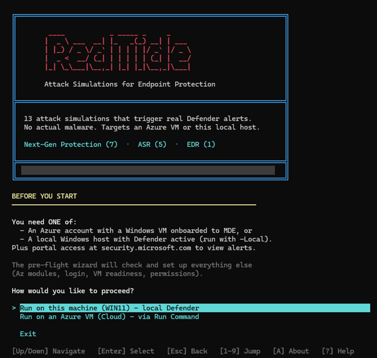
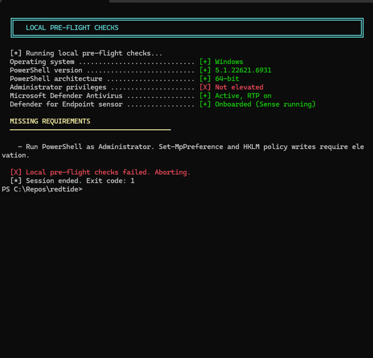
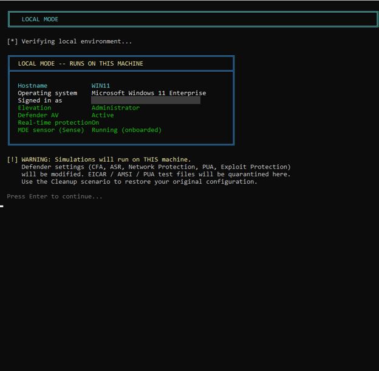
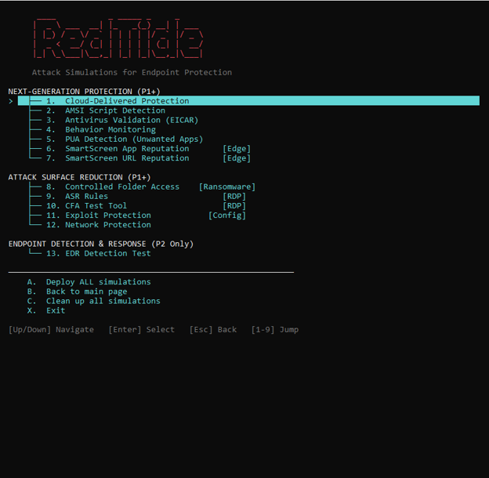
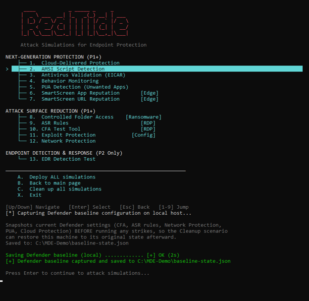
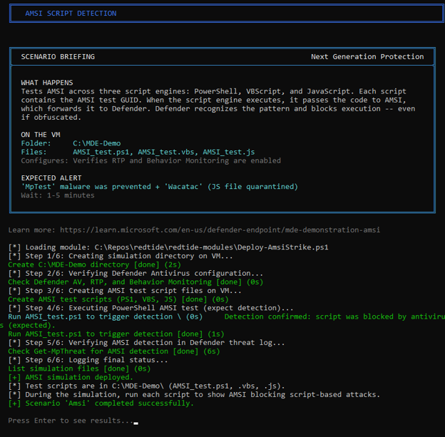
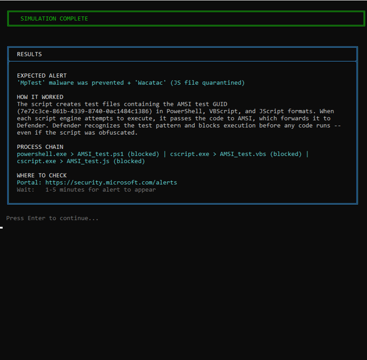
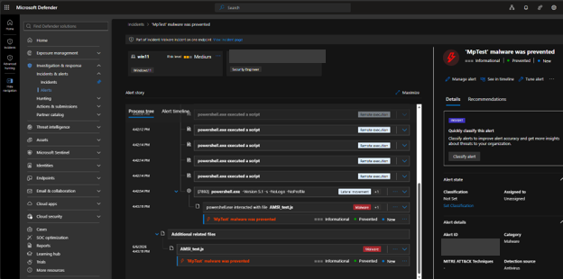
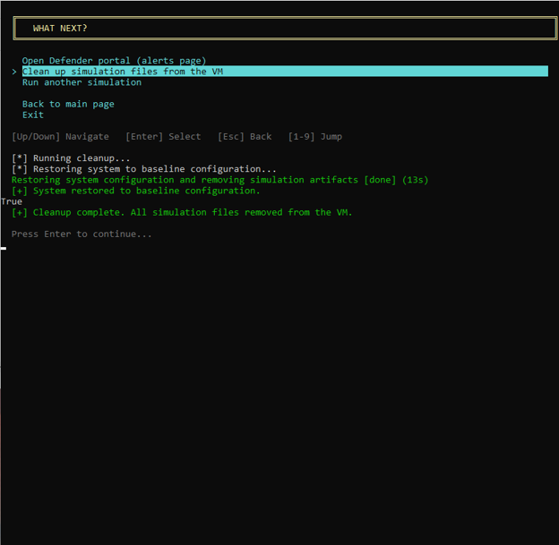

# RedTide screenshot walkthrough

[Back to the README](../README.md)

Here is a local run, from choosing the target to finding the resulting alert in Defender. The example uses the AMSI script detection scenario.

These screenshots come from an earlier local lab run. Some labels differ from the current release, and identifying details are redacted.

## 1. Choose where to run

The welcome screen offers two targets: the Windows machine running RedTide, or an Azure VM. This walkthrough uses the local machine.

## 2. Check the prerequisites

Pre-flight checks the local environment before you proceed. This attempt fails because PowerShell was not opened as Administrator. The other checks pass, but the missing elevation needs to be resolved before running a scenario.

## 3. Confirm the target

With an elevated session, the target card shows the operating system, administrator status, and Defender components. Check this card before continuing: local mode changes the machine you are sitting at.

## 4. Pick a simulation

The menu groups scenarios into next-generation protection, attack surface reduction, and EDR. You can select one test, run the full set, or choose cleanup. For this example, select **AMSI Script Detection**.

## 5. Save the baseline

Before the first simulation, RedTide attempts to save selected Defender settings to `C:\MDE-Demo\baseline-state.json`. Cleanup uses that file later. It records part of the configuration, not a full machine backup.

## 6. Read the briefing and run the test

The briefing explains what the test will do, which files it creates, and the detection to look for. AMSI lets script engines submit content to antivirus for inspection; this scenario uses a recognized test pattern.

Below the briefing, the console shows the execution steps. In this run, it reports that antivirus blocked the PowerShell test.

## 7. Find out where to look

The results card identifies the expected alert and process chain, then points you to the Defender portal. Here it lists **MpTest malware was prevented** and an estimated wait of one to five minutes. This is guidance for reviewing the detection, not confirmation that an alert reached the portal.

## 8. Inspect the alert in Defender

Open the alert for the lab device and examine its process tree. This screenshot shows the **MpTest malware was prevented** alert with the test activity. It connects what ran in the console to what Defender recorded.

## 9. Clean up

Choose cleanup when you are finished reviewing the results. The console below reports that it restored settings and removed the simulation files.

That message is not proof of a complete rollback. Some Defender and Office changes can remain; revert the disposable VM to its checkpoint after testing. See [cleanup and recovery](../README.md#cleanup-and-recovery) for the current limits.

[Back to setup and usage](../README.md#usage)
